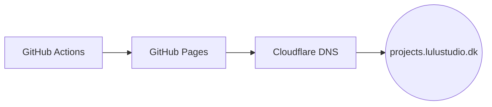

# § LuluStudio Hub

**LuluStudio's desktop apps, Discord bots and tools for [Albion Online](https://albiononline.com) and Whiteout Survival, all on one page.**

&nbsp;

### [projects.lulustudio.dk](https://projects.lulustudio.dk) &nbsp;·&nbsp; [AO-SAGE](https://ao-sage.com) &nbsp;·&nbsp; [AlbionPacketExplorer](https://projects.lulustudio.dk/apx/) &nbsp;·&nbsp; [Bots](https://projects.lulustudio.dk/#bots)

---

## What is this

The source of [projects.lulustudio.dk](https://projects.lulustudio.dk). It is a small static site written by hand, with no framework and no build step, that lists LuluStudio's projects and bots and links their desktop downloads. Each card shows live GitHub data (language, commit activity, last push) and opens a details view with a commit chart and a language breakdown.

## What's inside

### Apps and projects
| Project | What it does | Stack |
|---|---|---|
| [AO-SAGE](https://ao-sage.com) | Albion Online companion platform with daily production bonuses, market prices, Destiny boards, island management, a Discord bot and a desktop and Android companion app. | TypeScript · SvelteKit · C# |
| [AlbionPacketExplorer (APX)](https://projects.lulustudio.dk/apx/) | Captures Albion's network traffic live and decodes every packet, for protocol reverse engineering. Open source (MIT) and updates itself. | C# · Avalonia |
| WOS - Java App | Automates Whiteout Survival by driving Android emulators. | Java |
| GitRekt | Whiteout Survival automation for resources, combat, city upgrades and alliance tasks on Android / LDPlayer. | Python |
| SkatMate | Calculators and plain-language guides for non-Danish residents filing taxes via skat.dk. | Early development |
| OpenToWork | Job search helper that scrapes job portals, scores each posting against a candidate profile, and tracks the applications sent. | Bun · SQLite |

### Bots
Discord bots, each self-hosted in Docker.

| Bot | What it does | Stack |
|---|---|---|
| AO-Butler | Albion item lookup, live market prices, crafting bonuses and guild utilities. | Python |
| AO-Micar | MICAR guild bot for objective tracking, black-zone map data and guild utilities. | Node.js |
| TimeKeeper | Stores each member's UTC offset and shows local times across the server. | Node.js |
| GitRekt - Discord | Whiteout Survival bot with troop-training calculators, event stats read by OCR, and guild utilities. | Python |

## How it works

GitHub Actions publishes [`site/`](site/) to GitHub Pages on every push and once an hour, and Cloudflare points the domain at it. Each run regenerates [`site/js/data.js`](site/js/data.js) from the GitHub API, so the cards show current commit activity. Download buttons link straight to the latest GitHub release, and the desktop apps update themselves from there.
